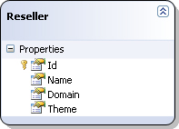
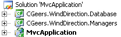
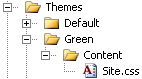

# ASP.NET MVC Themed View Engine

## Introduction

My [previous post](https://github.com/geersch/MagentoCoreAPI) dealt with how to use [Magento](http://www.magentocommerce.com/)'s API with WCF. Another aspect of Magento I came across is it's extremely flexible support for theming.

You can design a new theme that looks radically different from the default one. Not only can you change the images and colors in the cascading style sheets, you can also redefine the regions (header, content, footer...) that make up a page. Per region you can specify which HTML gets injected into it. This gives you maximum customization power for theming your site.

Theming in ASP.NET is supported out-of-the-box. Using the App_Themes folder you can customize the look and feel of your site, however cumbersome this system may be.

Magento is built using the [MVC pattern](http://en.wikipedia.org/wiki/Model%E2%80%93view%E2%80%93controller), just like the [ASP.NET MVC Framework](http://www.asp.net/mvc/). And that is the focus of this article. How do we go about implementing theming in ASP.NET MVC?

Let's get started...

## Goals

Before we start coding let's summarize the goals we want to achieve. Let's assume that we own a company that imports furniture made in China, Vietnam, South-Korea...etc. We don't sell directly to end-users, but to resellers.

We want to design an ASP.NET MVC powered web application that can be used as an e-commerce site by all of our resellers. Each reseller has his own domain name and wants to sell his goods online. Each of these domains is linked to our single web application.

The functionality offered by the web application is the same for each reseller, but each reseller wants to customize his online shop by applying a custom theme. We will support the following situations:

- **Replace The Cascading Style Sheet (CSS)**: Some resellers are happy using the default theme, but just want to change the logo, some background colors, the font type...etc. This can easily be achieved by having the default theme use a different style sheet.
- **Replace The Master Page**: For those resellers that want a bit more, we can offer to replace the master page and style sheet altogether. The views and partial views used will be those of the default theme.
- **Replace Views & Partial Views**: If a reseller wants a different view for the product detail page for instance, this is possible by creating a new view and adding it to his theme. The default view from the default theme will then be replaced by this new view. The same should be possible for partial views (e.g. a logon control)

So we have to figure out how we can dynamically replace the style sheet (CSS), the master page, views and partial views.

## Laying The Foundations

Before we can start, we need to lay the groundwork. Let's start by constructing the basics for a simple demo application.

**Remark**: In this section I give a quick overview of setting up a demo application so that the theming feature can be demonstrated. This is just a quick and easy approach. The focus of this article is not on how to design a domain model, designing your business logic layer...etc. So I keep this as short as possible. Feel free to improve on it.

Database

Create a new database using [Sql Server Express](http://www.microsoft.com/express/Database/) (2005 or 2008). Inspired by the [NorthWind database](http://www.microsoft.com/downloads/details.aspx?FamilyID=06616212-0356-46A0-8DA2-EEBC53A68034&displaylang=en) I named my database \[WindDirection\].

This database contains exactly one table called \[Reseller\]. Design the table as shown in the following figure.

**Figure 1** - \[Reseller\] table

![[Reseller] Table Design](images/reseller-table1.jpg "Reseller Table")

As you can see the Id column is the primary key and it uses the identity specification (= autoincrement). Also add a unique constraint on the Domain column as each reseller has his own unique domain.

**Remark**: The source code accompanying this article contains a script (DDL.sql) that allows you to quickly generate this table if you don't want to design it by hand.

The last part of setting up our database is entering some dummy records for the \[Reseller\] table. Please enter the following records:

**Figure 2** - Resellers

[](images/resellers.jpg)

We have four resellers. The first reseller has no custom theme and falls back on the default one. All the others have their own custom theme defined.

### The Solution

Start Visual Studio 2008 and create a new blank solution titled "MvcApplication". Add a new code library and call it "CGeers.WindDirection.Database". Delete the automatically generated Class1.css file.

Next add a new LINQ to SQL classes item and name it "DataClasses". Rename the new datacontext to "WindDirectionDataContext". Now drag the \[Reseller\] table from the Server Explorer tab onto the LINQ to SQL designer surface.

**Figure 3** - Reseller Entity

[](images/reseller-entity.jpg)

Set the datacontext's connection property to "None" and delete the connection string application setting and the application configuration file (App.config). I'm not fond of the fact that Visual Studio injects the connection string for me. I like to do it myself.

That's why I've added the following partial class to this assembly which handles initializing the datacontext with a connection string. The only part we have to agree on is that the connection string is named "WindDirection".

**Listing 1** - WindDirectionDataContext Class

```csharp
public partial class WindDirectionDataContext
{
    private static readonly string ConnectionString;

    static WindDirectionDataContext()
    {
        ConnectionStringSettings settings = ConfigurationManager.ConnectionStrings["WindDirection"];
        ConnectionString = settings != null ? settings.ConnectionString : String.Empty;
    }

    public WindDirectionDataContext() : base(ConnectionString) { }
}
```

Don't forget to add a reference to the System.Configuration assembly. As long as you'll include a connection string called "WindDirection" in the applications that reference this assembly it will work just fine.

### Business Logic

We're almost there. Just hold on, we'll make it through. Now add a new code library to the solution called "CGeers.WindDirection.Managers". Delete the automatically generated Class1.cs file and add a reference to the System.Data.Linq assembly.

Add a new class called Manager and add the following code to it:

**Listing 2** - Abstract Manager

```csharp
public abstract class Manager
{
    protected Manager()
    {
        Context = new WindDirectionDataContext();
    }

    public WindDirectionDataContext Context { get; set; }
}
```

This very simple class creates a new datacontext on which we can unleash our LINQ queries later on.

Next add a class called "ResellerManager" to the project and add the code shown in Listing 3.

**Listing 3** ResellerManager

```csharp
public class ResellerManager : Manager
{
    public string GetThemeForDomain(string domain)
    {
        var q = from r in Context.Resellers
                where r.Domain == domain
                select r.Theme;
        string theme = q.SingleOrDefault();
        return !String.IsNullOrEmpty(theme) ? theme : "Default";
    }
}
```

This manager class descends from our abstract Manager class and adds one method called GetThemeForDomain(...). This method looks up a reseller's theme based on a given domain name. As each domain is uniquely tied to one reseller this poses no problem.

Voila, that is all the data access that is needed for our demo application. We need to figure out a reseller's theme based on the domain of the incoming request and then we have to apply it.

**Remark**: Beware of using the LINQ to SQL context in an ASP.NET powered application. Though not demonstrated in this article, because it would distract too much from our main endeavour, it is advisable to only create one context per request. Store the context in the request's HttpContext so that you can access it at all times during the request.

A while back I wrote an article specifically about this, check out the [Entity Framework ObjectContext](https://github.com/geersch/EntityFrameworkObjectContext) article here. Though it deals with the Entity Framework instead of LINQ to SQL it is still applicable.

### ASP.NET MVC Web Application

The final step in completing our basic demo application is adding a new web site project to the solution. Add a new project to the solution based on the ASP.NET MVC Web Application project template and name it "MvcApplication". You'll be asked if you also want to create a unit test project for this application. Choose "No" to skip this as we don't need it for this article.

Visual Studio will generate a "Hello, World!"-type ASP.NET MVC application that contains a number of default pages (home, about, log on...etc.). Add your connection string to the Web.config file and add references to the CGeers.WindDirection.Database and CGeers.WindDirection.Managers assemblies.

**Remark**: The Web.config contains a number of configuration settings referring to the ASP.NET Membership, Profile, Roles...providers. You can go ahead and delete these as we don't need them.

Your solution explorer should resemble Figure 4.

**Figure 4** - Solution Explorer

[](images/solution.jpg)

**Remark**: At the time of writing this article I'm using ASP.NET MVC Version 1.0. However version 2.0 will be released in the near future.

## Theme Http Module

When running the web application the first thing it needs to figure out is the theme which it needs to apply. This needs to be done for every single request. So plugging in a custom HTTP module in the request-pipeline seems appropriate.

Add a new class to the MvcApplication project and call it ThemeHttpModule. Have the class implement the [IHttpModule interface](http://msdn.microsoft.com/en-us/library/system.web.ihttpmodule.aspx). The entire code for this class is shown in Listing 4.

This article is not a primer on writing HTTP modules so if you require more information, please check out the "[Walkthrough: Creating and Registering a Custom HTTP Module](http://msdn.microsoft.com/en-us/library/ms227673.aspx)" article on [MSDN](http://www.msdn.com).

**Listing 4** - ThemeHttpModule

```csharp
public class ThemeHttpModule : IHttpModule
{
    public void Init(HttpApplication application)
    {
        application.BeginRequest += application_BeginRequest;
    }

    private void application_BeginRequest(object sender, EventArgs e)
    {
        HttpApplication application = (HttpApplication) sender;
        HttpContext context = application.Context;
        if (context.Cache == null)
        {
            return;
        }

        string domain = context.Request.Url.GetDomain();

        string cacheKey = String.Format(CultureInfo.InvariantCulture, "theme_for_{0}", domain);

        if (context.Cache[cacheKey] == null)
        {
            ResellerManager manager = new ResellerManager();
            string theme = manager.GetThemeForDomain(domain);
            context.Cache[cacheKey] = theme;
        }
    }

    public void Dispose() { }
}
```

This HTTP module adds an event handler for the [BeginRequest event](http://msdn.microsoft.com/en-us/library/system.web.httpapplication.beginrequest.aspx). This event occurs as the first event in the HTTP pipeline chain of execution when ASP.NET responds to a request.

Here we extract the domain name from the incoming request. Next we retrieve the theme for this domain by using the ResellerManager's GetThemeForDomain(...) method. The result is then cached. The next time a request for this domain is triggered the theme will be retrieved from the cache and no database query will be fired.

The GetDomain() method is an extension method for the [Uri Class](http://msdn.microsoft.com/en-us/library/system.uri.aspx). Check out the source code of this article to see how it works. In a similar way you could opt to extract the subdomain (e.g.: www, admin...etc) from the request. You can then expand your theming engine to apply different themes for each subdomain of a domain.

Last but not least register the ThemeHttpModule by creating an entry in the Web.config file. This is required in order to subscribe the HTTP module to the request-pipeline notifications.

**Listing 5** - Register The ThemeHttpModule

```xml
<httpModules>
  <add name="ThemeHttpModule" type="MvcApplication.ThemeHttpModule" />
  <!-- ... -->
</httpModules>
```

## Theme Folder Structure

When you start the web application you'll receive the default look & feel as displayed in Figure 5. Visual Studio will generate some default pages (home, about, log on...etc.) including a master page and a style sheet. We'll use these files to make up our default theme.

**Figure 5** - ASP.NET MVC Application Default Theme


By default all the files are saved in the Content and Views folders. We need to implement our own directory structure so that we can logically group our themes. Therefore create a new folder called Themes. Create a subfolder for the Themes directory and call it Default. Move the Content and Views directory under this Default directory.

After moving the Content and Views folders you need to adjust the MasterPageFile property of the page directive for each of the views! The old value references a location that no longer exists. Change **MasterPageFile="~/Views/Shared/ Site.Master"** to **MasterPageFile="~/Themes/Default/Views/Shared/ Site.Master"**!

**Figure 6** - Default Theme


Voila, our default theme has been setup. If you want to create a new theme you only need to create a new folder and place it under the Themes folder. As you can see in the previous screenshot we'll be creating some other themes (Green, Orange, Red) later on.

## View Engine

We just moved our master pages, style sheets, views...etc. to another directory. If we start our web application now we'll receive the following exception:

**Figure 7** - InvalidOperationException


The view 'Index' or its master could not be found. The following locations were searched:

- ~/Views/Home/Index.aspx
- ~/Views/Home/Index.ascx
- ~/Views/Shared/Index.aspx
- ~/Views/Shared/Index.ascx

MVC is trying to locate a view for your default start page, but cannot find it in the default locations it searches thus you receive an exception. We moved these files to our default theme folder and soon we'll be creating other themes. We need a way to inform MVC of the locations where to search for its views, master page, partial views...etc. These locations differ depening on the theme of the reseller.

So basically all we need to do to support theming in ASP.NET MVC is:

- Figure out which theme to use. This is done by the ThemeHttpModule we made earlier.
- Tell ASP.NET MVC where to search for the views for the specified theme.

To do this we need to write our own view engine. MVC uses a view engine to render pages for the response. This view engine is responsible for locating the master page, views and partial views. By default the [WebFormViewEngine](http://msdn.microsoft.com/en-us/library/system.web.mvc.webformviewengine.aspx) is used.

We need to replace this default view engine by our own. To do this add a new class called ThemedViewEngine to the MvcApplication project and have it descend from the WebFormViewEngine class.

**Listing 6** - ThemedViewEngine

```csharp
public class ThemedViewEngine : WebFormViewEngine
{
    #region Constructor(s)

    // Replace the default search paths by our own.
    public ThemedViewEngine()
    {
        // Search paths for the master pages
        base.MasterLocationFormats = new[]
                                         {
                                             "~/Themes/{2}/Views/{1}/{0}.master",
                                             "~/Themes/{2}/Views/Shared/{0}.master"
                                         };

        // Search paths for the views
        base.ViewLocationFormats = new[]
                                       {
                                           "~/Themes/{2}/Views/{1}/{0}.aspx",
                                           "~/Themes/{2}/Views/{1}/{0}.ascx",
                                           "~/Themes/{2}/Views/Shared/{0}.aspx",
                                           "~/Themes/{2}/Views/Shared/{0}.ascx",
                                       };

        // Search parts for the partial views
        // The search parts for the partial views are the same as the regular views
        base.PartialViewLocationFormats = base.ViewLocationFormats;
    }

    #endregion
}
```

In the constructor of this new view engine we set the MasterLocationFormats, ViewLocationFormats and PartialViewLocationFormats to new locations, e.g.: ~/Themes/{2}/Views/{1}/{0}.aspx.

Each path contains 3 parts that are dynamically determined.

- **{2}**: The name of the theme.
- **{1}**: The name of the controller.
- **{0}**: The name of the master page, view or partial view.

In order to use the new view engine you need to register it. Do this by adding the following code to the Application_Start event handler located in the Global.asax.cs file.

**Listing 7** - Register The ThemedViewEngine

```csharp
protected void Application_Start()
{
    ViewEngines.Engines.Clear();
    ViewEngines.Engines.Add(new ThemedViewEngine());

    RegisterRoutes(RouteTable.Routes);
}
```

Here you clear any view engines that may have been loaded earlier and inject your own. Now all that remains is to instruct the view engine how to format the new search paths so that it correctly finds the requested files. To do this you need to override the following two methods:

**Listing 8** - FindPartialView(...) & FindView(...) Methods

```csharp
public override ViewEngineResult FindPartialView(ControllerContext controllerContext, string partialViewName, bool useCache)

public override ViewEngineResult FindView(ControllerContext controllerContext, string viewName, string masterName, bool useCache)
```

I'm not going to include the code for these two functions here, because it is quite lengthy and has a few references to private helper methods. Basically these two methods follow the same pattern:

- Retrieve which theme needs to be loaded by checking the HttpApplication's cache. The theme to be used is injected here by our ThemeHttpModule.
- Format the search paths by injecting the theme, controller and name of the master page, view or partial view.
- Iterate the search paths and determine if the requested master page, view or partial view exists.
- If the requested file could not be found, then replace the theme by the Default theme and iterate the search paths again.

So our new view engine basically search our Themes folder and if it cannot find the requested master page, view or partial view it uses that of the default theme. Ofcourse the default theme needs to be complete and cannot have any missing files.

This enables you to create themes that only contain a master page that in turn references a different style sheet or themes that contain views and / or partial views for just those sections that you want to style differently.

By following this pattern you can create themes that only override certain views and fall back on the views of the default theme if no custom view is provided.

I based my view engine on the work of Chris Pietschmann's excellent article about [theming in ASP.NET MVC](http://pietschsoft.com/post/2009/03/ASPNET-MVC-Implement-Theme-Folders-using-a-Custom-ViewEngine.aspx). I suggest you checkout [his article](http://pietschsoft.com/post/2009/03/ASPNET-MVC-Implement-Theme-Folders-using-a-Custom-ViewEngine.aspx) as it contains more information about how the view engine internally works.

With the new view engine in place we can run the web application again without any exceptions as it is now able to resolve the requests for the master page, views and partial views.

**Remark**: I altered the code a bit so that when the view engine cannot resolve a request for a certain master page, view or partial view it falls back on those found in the Default theme. So be sure to check out the source code of this article too.

## Additional Themes

Let's quickly create a new theme. Add a new folder called "Red" under the themes folder. Copy the site.master and site.css from the default theme as shown in the following figure.

**Figure 8** - Red Theme


Open the red theme's style sheet and change the background-color property of the body element. Set it to red. Now open the \[Reseller\] table and set the theme field to "Red" for the reseller whose domain is set to localhost. Restart the web application and it should now be using the master page and style sheet of the red theme.

**Figure 9** - Red Theme In Action


Likewise you can create an Orange theme that not only contains a master page but also a different view for the home page.

**Figure 10** - Orange Theme


The orange theme will render the new view for the home page instead of the default view. If you want to replace a partial view you can do so in the same way. Just copy the default partial view into the same location under the new theme folder and adjust it as needed.

## Dynamic Style Sheet

For each theme you are now able to serve up different master pages, views and partial views. There is one remaining scenario that I wish to support. Resellers that are satisfied with the default view but only want to adjust the logo, some colors...etc. can easily be contented by applying a different style sheet to the default theme.

Add a new theme folder under the Themes directory and call it Green. Copy the style sheet of the default theme to the Green theme as shown in the following figure.

**Figure 11** - Green Theme



Open the green theme's style sheet and adjust the background-color property of the body element to green. If you set the theme for the reseller with the domain localhost to Green and start the application you'll notice that it is still using the style sheet of the default theme.

This is caused by the fact that the green theme does not have its own master page. It uses the master page of the default theme and this master page references its own style sheet.

Open the master page of the default theme and replace the line:

```html
<link href="../../Content/Site.css" rel="stylesheet" type="text/css" />
```

with

```html
<link href="<%" ="Html.GetThemedStyleSheet()" % /> rel="stylesheet"
type="text/css" />
```

The GetThemedStyleSheet() method is an extension method for the Html utility class. Add a new class called HtmlHelperExtensions to the project and add the following code to it.

**Listing 9** - HtmlHelperExtensions

```csharp
public static class HtmlHelperExtensions
{
    public static string GetThemedStyleSheet(this HtmlHelper html)
    {
        HttpContext context = HttpContext.Current;
        if (context == null)
        {
            throw new InvalidOperationException("Http Context cannot be null.");
        }

        string defaultStyleSheet = context.Server.MapPath("~/Themes/Default/Content/Site.css");

        string domain = context.Request.Url.GetDomain();
        string cacheKey = String.Format(CultureInfo.InvariantCulture, "theme_for_{0}", domain);
        string theme = (string) context.Cache[cacheKey];
        if (String.IsNullOrEmpty(theme) || theme == "Default")
        {
            return defaultStyleSheet;
        }

        string styleSheet = context.Server.MapPath(String.Format(CultureInfo.InvariantCulture,
            "~/Themes/{0}/Content/Site.css", theme));
        if (!File.Exists(styleSheet))
        {
            styleSheet = defaultStyleSheet;
        }
        return String.Format(CultureInfo.InvariantCulture, "'{0}'", styleSheet);
    }
}
```

The GetThemedStyleSheet() method loads the theme from the HttpApplication's cache and checks if this theme has its own style sheet. If not it falls back on the style sheet of the default theme. The code contains some hard-coded strings, though not optimal it does the trick. Feel free to improve this method.

If you start the web application now you'll get a nice green background.

## Summary

This article shows you how you can enable theming in ASP.NET MVC. To do so you only need to implement two things, namely:

- Implement a custom HTTP module which loads the theme to use for each request.
- Implement a custom view engine which helps ASP.NET MVC resolve the locations for a theme's master pages, views and partial views.

The theming system we implemented uses a default theme and checks if it needs to replace parts of this default theme with that of a custom theme. You can easily support one of the following scenario's or combine them:

- Replace The Cascading Style Sheet (CSS)
- Replace The Master Page
- Replace Views & Partial Views
